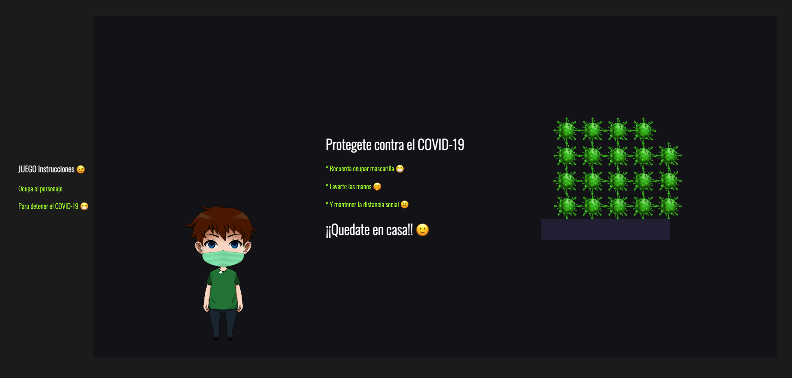

  <a href="https://lucid-agnesi-8dbaf1.netlify.app/" target="_blank">
    <h1>COVID JS</h1>
  </a>

[**COVIDJS**](COVID JS) es un juego java script basado en la libreria matter.js <a href="https://brm.io/matter-js/" target="_blank">matter.js</a> usando animaciones 2d.

### Este repositorio intenta ser un acercamiento a las bondades de la libreria de animaciones 2d matter :heart:.

## Mi canal de youtube 

[Youtube](https://www.youtube.com/channel/UCQsrs_h91Q-baLx-n_rcdNg)

## Mis articulos en medium
[medium](https://devjaime.medium.com/)

## Mi twitter por si quieres contacterme
[medium](https://twitter.com/HsJhernandez)

### :heart: ¿Te gusto este proyecto?

Si te gusto este proyecto comparte y dale una estrella :star: en Github y no dudes en contactarme.

